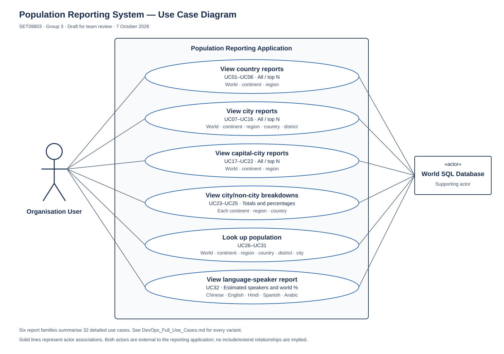

# Population Reporting System — Full Use Cases

SET09803 DevOps · Group 3 · Draft for team review · 7 October 2026

Use-case documentation contribution: Thaddeus Cornish Jr. · GitHub issues #17 and #18. The team should review and agree the contents before submission. These are requirements specifications, not evidence that features have been implemented.

## Scope and actor

The system provides read-only population reports from the supplied World SQL database. **Organisation User** is the primary actor for all 32 use cases. The database is treated as an internal data dependency within the Population Reporting System boundary. Login, administration, exporting, and changing population records are outside the supplied brief.

The application’s input mechanism is not fixed here: “request” and “select” can be implemented through command-line arguments, a menu, or another interface agreed by the team. The existing top-three-country demonstration is an initial implementation example, not evidence that the complete requirements are met.

## Shared conditions and error handling

These conditions apply to every use case below and form part of each full definition.

- **Preconditions:** the application is running; the supplied World dataset is loaded; database access is configured and available.
- **Trigger:** the Organisation User requests the named report or lookup.
- **Success postcondition:** the requested report or lookup is presented; source data is unchanged.
- **Failure postcondition:** no successful result is claimed; source data is unchanged.
- **Database/query failure:** show a clear failure message and allow a retry or return to the application’s available choices. Do not present a partially retrieved report as complete.
- **Missing required data:** clearly flag unavailable values or an incomplete result. Do not invent population values.
- **Validation:** invalid or ambiguous inputs must be resolved before a report runs. N must be a positive whole number within the implementation’s supported integer range.
- **Display:** use understandable column headings, readable population numbers, and consistent percentage rounding. Secondary ordering for population ties is a team design choice; use it consistently.

## Data interpretation and decisions for team review

1. “Living in cities” means population recorded in the supplied city table. “Not living in cities” is the residual against country totals. The dataset may omit settlements, so this is a dataset-derived breakdown rather than a verified current urban/rural demographic measure.
2. District population is the sum of the dataset’s city populations for that district. The brief supplies no independent district population table. Identify the district’s country where necessary to avoid combining unrelated districts with the same name.
3. Language-speaker figures are estimates derived from country-language percentages. They are not a partition of world population; speakers may overlap across languages. Do not filter on official-language status because the brief asks for speakers, not only official-language speakers.
4. Aggregate country and city totals separately for breakdown reports, then combine them. Directly summing country populations after joining multiple cities can inflate totals.
5. Treat a missing capital as unavailable in country reports and exclude nonexistent capital records from capital-city reports. Match capitals by country.Capital = city.ID, not by city name.
6. World population means the sum in the supplied database, not a live population estimate. Use a numeric type large enough for world totals.
7. The diagram groups report variants into six families for readability; the index and definitions preserve all 32 requirement mappings. These families do not imply UML include/extend relationships.

## Requirement and use-case index

| Requirement | Use case | Required behaviour                                   |
| ----------- | -------- | ---------------------------------------------------- |
| R01         | UC01     | View all countries in the world                      |
| R02         | UC02     | View all countries in a continent                    |
| R03         | UC03     | View all countries in a region                       |
| R04         | UC04     | View top N countries in the world                    |
| R05         | UC05     | View top N countries in a continent                  |
| R06         | UC06     | View top N countries in a region                     |
| R07         | UC07     | View all cities in the world                         |
| R08         | UC08     | View all cities in a continent                       |
| R09         | UC09     | View all cities in a region                          |
| R10         | UC10     | View all cities in a country                         |
| R11         | UC11     | View all cities in a district                        |
| R12         | UC12     | View top N cities in the world                       |
| R13         | UC13     | View top N cities in a continent                     |
| R14         | UC14     | View top N cities in a region                        |
| R15         | UC15     | View top N cities in a country                       |
| R16         | UC16     | View top N cities in a district                      |
| R17         | UC17     | View all capital cities in the world                 |
| R18         | UC18     | View all capital cities in a continent               |
| R19         | UC19     | View all capital cities in a region                  |
| R20         | UC20     | View top N capital cities in the world               |
| R21         | UC21     | View top N capital cities in a continent             |
| R22         | UC22     | View top N capital cities in a region                |
| R23         | UC23     | View city and non-city population for each continent |
| R24         | UC24     | View city and non-city population for each region    |
| R25         | UC25     | View city and non-city population for each country   |
| R26         | UC26     | Look up population of the world                      |
| R27         | UC27     | Look up population of a continent                    |
| R28         | UC28     | Look up population of a region                       |
| R29         | UC29     | Look up population of a country                      |
| R30         | UC30     | Look up population of a district                     |
| R31         | UC31     | Look up population of a city                         |
| R32         | UC32     | View speakers of the five specified languages        |

R01–R32 and UC01–UC32 are local reference labels added for this documentation; the lecturer’s brief does not prescribe these labels. Requirements follow the brief’s order.

## Full definitions

### UC01 — View all countries in the world

**Requirement:** R01 (the corresponding item in the coursework specification).

**Actor:** Organisation User.

**Goal:** Compare all countries in the world, ordered from largest population to smallest.

**Inputs:** None; no geographical selection or N value is required.

**Preconditions, trigger and postconditions:** the shared conditions above apply.

**Main success flow:**

1. User requests all countries in the world.
2. System retrieves country records and resolves capital names; a missing capital does not exclude the country.
3. System includes records worldwide and sorts by population from largest to smallest; equal populations use a consistent secondary order.
4. System displays the report with these columns: Code, Name, Continent, Region, Population, Capital.

**Alternative and exception flows:**

- No matching records: show an explicit empty-result message.
- Capital is absent: show “Not recorded” in the Capital column.
- Database/query failure or missing required data: follow the shared error handling above.

**Required output:** Code, Name, Continent, Region, Population, Capital

### UC02 — View all countries in a continent

**Requirement:** R02 (the corresponding item in the coursework specification).

**Actor:** Organisation User.

**Goal:** Compare all countries in a continent, ordered from largest population to smallest.

**Inputs:** A valid continent identifier or selection.

**Preconditions, trigger and postconditions:** the shared conditions above apply.

**Main success flow:**

1. User requests all countries in a continent.
2. System obtains and validates the continent selection.
3. System retrieves country records and resolves capital names; a missing capital does not exclude the country.
4. System applies the continent scope, sorts by population descending, and uses a consistent secondary order for equal populations.
5. System displays the report with these columns: Code, Name, Continent, Region, Population, Capital.

**Alternative and exception flows:**

- No matching records: show an explicit empty-result message.
- Unknown or ambiguous scope: explain the problem and request a valid, unambiguous selection.
- Capital is absent: show “Not recorded” in the Capital column.
- Database/query failure or missing required data: follow the shared error handling above.

**Required output:** Code, Name, Continent, Region, Population, Capital

### UC03 — View all countries in a region

**Requirement:** R03 (the corresponding item in the coursework specification).

**Actor:** Organisation User.

**Goal:** Compare all countries in a region, ordered from largest population to smallest.

**Inputs:** A valid region identifier or selection.

**Preconditions, trigger and postconditions:** the shared conditions above apply.

**Main success flow:**

1. User requests all countries in a region.
2. System obtains and validates the region selection.
3. System retrieves country records and resolves capital names; a missing capital does not exclude the country.
4. System applies the region scope, sorts by population descending, and uses a consistent secondary order for equal populations.
5. System displays the report with these columns: Code, Name, Continent, Region, Population, Capital.

**Alternative and exception flows:**

- No matching records: show an explicit empty-result message.
- Unknown or ambiguous scope: explain the problem and request a valid, unambiguous selection.
- Capital is absent: show “Not recorded” in the Capital column.
- Database/query failure or missing required data: follow the shared error handling above.

**Required output:** Code, Name, Continent, Region, Population, Capital

### UC04 — View top N countries in the world

**Requirement:** R04 (the corresponding item in the coursework specification).

**Actor:** Organisation User.

**Goal:** Compare the top N countries in the world, ordered from largest population to smallest.

**Inputs:** No geographical input. A positive whole number N.

**Preconditions, trigger and postconditions:** the shared conditions above apply.

**Main success flow:**

1. User requests the top N countries in the world.
2. System obtains N from the user and validates it as a positive whole number.
3. System retrieves country records and resolves capital names; a missing capital does not exclude the country.
4. System includes records worldwide and sorts by population from largest to smallest; equal populations use a consistent secondary order.
5. System selects at most N records from the sorted result.
6. System displays the report with these columns: Code, Name, Continent, Region, Population, Capital.

**Alternative and exception flows:**

- No matching records: show an explicit empty-result message.
- N is blank, non-numeric, zero, negative or fractional: request a positive whole number; do not run the report with that value.
- N exceeds matching records: display all available matching records.
- Capital is absent: show “Not recorded” in the Capital column.
- Database/query failure or missing required data: follow the shared error handling above.

**Required output:** Code, Name, Continent, Region, Population, Capital

### UC05 — View top N countries in a continent

**Requirement:** R05 (the corresponding item in the coursework specification).

**Actor:** Organisation User.

**Goal:** Compare the top N countries in a continent, ordered from largest population to smallest.

**Inputs:** A valid continent identifier or selection. A positive whole number N.

**Preconditions, trigger and postconditions:** the shared conditions above apply.

**Main success flow:**

1. User requests the top N countries in a continent.
2. System obtains and validates the continent selection and a positive whole number N.
3. System retrieves country records and resolves capital names; a missing capital does not exclude the country.
4. System applies the continent scope, sorts by population descending, and uses a consistent secondary order for equal populations.
5. System selects at most N records from the sorted result.
6. System displays the report with these columns: Code, Name, Continent, Region, Population, Capital.

**Alternative and exception flows:**

- No matching records: show an explicit empty-result message.
- Unknown or ambiguous scope: explain the problem and request a valid, unambiguous selection.
- N is blank, non-numeric, zero, negative or fractional: request a positive whole number; do not run the report with that value.
- N exceeds matching records: display all available matching records.
- Capital is absent: show “Not recorded” in the Capital column.
- Database/query failure or missing required data: follow the shared error handling above.

**Required output:** Code, Name, Continent, Region, Population, Capital

### UC06 — View top N countries in a region

**Requirement:** R06 (the corresponding item in the coursework specification).

**Actor:** Organisation User.

**Goal:** Compare the top N countries in a region, ordered from largest population to smallest.

**Inputs:** A valid region identifier or selection. A positive whole number N.

**Preconditions, trigger and postconditions:** the shared conditions above apply.

**Main success flow:**

1. User requests the top N countries in a region.
2. System obtains and validates the region selection and a positive whole number N.
3. System retrieves country records and resolves capital names; a missing capital does not exclude the country.
4. System applies the region scope, sorts by population descending, and uses a consistent secondary order for equal populations.
5. System selects at most N records from the sorted result.
6. System displays the report with these columns: Code, Name, Continent, Region, Population, Capital.

**Alternative and exception flows:**

- No matching records: show an explicit empty-result message.
- Unknown or ambiguous scope: explain the problem and request a valid, unambiguous selection.
- N is blank, non-numeric, zero, negative or fractional: request a positive whole number; do not run the report with that value.
- N exceeds matching records: display all available matching records.
- Capital is absent: show “Not recorded” in the Capital column.
- Database/query failure or missing required data: follow the shared error handling above.

**Required output:** Code, Name, Continent, Region, Population, Capital

### UC07 — View all cities in the world

**Requirement:** R07 (the corresponding item in the coursework specification).

**Actor:** Organisation User.

**Goal:** Compare all cities in the world, ordered from largest population to smallest.

**Inputs:** None; no geographical selection or N value is required.

**Preconditions, trigger and postconditions:** the shared conditions above apply.

**Main success flow:**

1. User requests all cities in the world.
2. System joins city records to their countries where needed for geographical filtering and country names.
3. System includes records worldwide and sorts by population from largest to smallest; equal populations use a consistent secondary order.
4. System displays the report with these columns: Name, Country, District, Population.

**Alternative and exception flows:**

- No matching records: show an explicit empty-result message.
- Database/query failure or missing required data: follow the shared error handling above.

**Required output:** Name, Country, District, Population

### UC08 — View all cities in a continent

**Requirement:** R08 (the corresponding item in the coursework specification).

**Actor:** Organisation User.

**Goal:** Compare all cities in a continent, ordered from largest population to smallest.

**Inputs:** A valid continent identifier or selection.

**Preconditions, trigger and postconditions:** the shared conditions above apply.

**Main success flow:**

1. User requests all cities in a continent.
2. System obtains and validates the continent selection.
3. System joins city records to their countries where needed for geographical filtering and country names.
4. System applies the continent scope, sorts by population descending, and uses a consistent secondary order for equal populations.
5. System displays the report with these columns: Name, Country, District, Population.

**Alternative and exception flows:**

- No matching records: show an explicit empty-result message.
- Unknown or ambiguous scope: explain the problem and request a valid, unambiguous selection.
- Database/query failure or missing required data: follow the shared error handling above.

**Required output:** Name, Country, District, Population

### UC09 — View all cities in a region

**Requirement:** R09 (the corresponding item in the coursework specification).

**Actor:** Organisation User.

**Goal:** Compare all cities in a region, ordered from largest population to smallest.

**Inputs:** A valid region identifier or selection.

**Preconditions, trigger and postconditions:** the shared conditions above apply.

**Main success flow:**

1. User requests all cities in a region.
2. System obtains and validates the region selection.
3. System joins city records to their countries where needed for geographical filtering and country names.
4. System applies the region scope, sorts by population descending, and uses a consistent secondary order for equal populations.
5. System displays the report with these columns: Name, Country, District, Population.

**Alternative and exception flows:**

- No matching records: show an explicit empty-result message.
- Unknown or ambiguous scope: explain the problem and request a valid, unambiguous selection.
- Database/query failure or missing required data: follow the shared error handling above.

**Required output:** Name, Country, District, Population

### UC10 — View all cities in a country

**Requirement:** R10 (the corresponding item in the coursework specification).

**Actor:** Organisation User.

**Goal:** Compare all cities in a country, ordered from largest population to smallest.

**Inputs:** A valid country identifier or selection.

**Preconditions, trigger and postconditions:** the shared conditions above apply.

**Main success flow:**

1. User requests all cities in a country.
2. System obtains and validates the country selection.
3. System joins city records to their countries where needed for geographical filtering and country names.
4. System applies the country scope, sorts by population descending, and uses a consistent secondary order for equal populations.
5. System displays the report with these columns: Name, Country, District, Population.

**Alternative and exception flows:**

- No matching records: show an explicit empty-result message.
- Unknown or ambiguous scope: explain the problem and request a valid, unambiguous selection.
- Database/query failure or missing required data: follow the shared error handling above.

**Required output:** Name, Country, District, Population

### UC11 — View all cities in a district

**Requirement:** R11 (the corresponding item in the coursework specification).

**Actor:** Organisation User.

**Goal:** Compare all cities in a district, ordered from largest population to smallest.

**Inputs:** A valid district identifier or selection. Also select its country when the district name is ambiguous.

**Preconditions, trigger and postconditions:** the shared conditions above apply.

**Main success flow:**

1. User requests all cities in a district.
2. System obtains and validates the district selection.
3. System joins city records to their countries where needed for geographical filtering and country names.
4. System applies the district scope, sorts by population descending, and uses a consistent secondary order for equal populations.
5. System displays the report with these columns: Name, Country, District, Population.

**Alternative and exception flows:**

- No matching records: show an explicit empty-result message.
- Unknown or ambiguous scope: explain the problem and request a valid, unambiguous selection.
- Database/query failure or missing required data: follow the shared error handling above.

**Required output:** Name, Country, District, Population

### UC12 — View top N cities in the world

**Requirement:** R12 (the corresponding item in the coursework specification).

**Actor:** Organisation User.

**Goal:** Compare the top N cities in the world, ordered from largest population to smallest.

**Inputs:** No geographical input. A positive whole number N.

**Preconditions, trigger and postconditions:** the shared conditions above apply.

**Main success flow:**

1. User requests the top N cities in the world.
2. System obtains N from the user and validates it as a positive whole number.
3. System joins city records to their countries where needed for geographical filtering and country names.
4. System includes records worldwide and sorts by population from largest to smallest; equal populations use a consistent secondary order.
5. System selects at most N records from the sorted result.
6. System displays the report with these columns: Name, Country, District, Population.

**Alternative and exception flows:**

- No matching records: show an explicit empty-result message.
- N is blank, non-numeric, zero, negative or fractional: request a positive whole number; do not run the report with that value.
- N exceeds matching records: display all available matching records.
- Database/query failure or missing required data: follow the shared error handling above.

**Required output:** Name, Country, District, Population

### UC13 — View top N cities in a continent

**Requirement:** R13 (the corresponding item in the coursework specification).

**Actor:** Organisation User.

**Goal:** Compare the top N cities in a continent, ordered from largest population to smallest.

**Inputs:** A valid continent identifier or selection. A positive whole number N.

**Preconditions, trigger and postconditions:** the shared conditions above apply.

**Main success flow:**

1. User requests the top N cities in a continent.
2. System obtains and validates the continent selection and a positive whole number N.
3. System joins city records to their countries where needed for geographical filtering and country names.
4. System applies the continent scope, sorts by population descending, and uses a consistent secondary order for equal populations.
5. System selects at most N records from the sorted result.
6. System displays the report with these columns: Name, Country, District, Population.

**Alternative and exception flows:**

- No matching records: show an explicit empty-result message.
- Unknown or ambiguous scope: explain the problem and request a valid, unambiguous selection.
- N is blank, non-numeric, zero, negative or fractional: request a positive whole number; do not run the report with that value.
- N exceeds matching records: display all available matching records.
- Database/query failure or missing required data: follow the shared error handling above.

**Required output:** Name, Country, District, Population

### UC14 — View top N cities in a region

**Requirement:** R14 (the corresponding item in the coursework specification).

**Actor:** Organisation User.

**Goal:** Compare the top N cities in a region, ordered from largest population to smallest.

**Inputs:** A valid region identifier or selection. A positive whole number N.

**Preconditions, trigger and postconditions:** the shared conditions above apply.

**Main success flow:**

1. User requests the top N cities in a region.
2. System obtains and validates the region selection and a positive whole number N.
3. System joins city records to their countries where needed for geographical filtering and country names.
4. System applies the region scope, sorts by population descending, and uses a consistent secondary order for equal populations.
5. System selects at most N records from the sorted result.
6. System displays the report with these columns: Name, Country, District, Population.

**Alternative and exception flows:**

- No matching records: show an explicit empty-result message.
- Unknown or ambiguous scope: explain the problem and request a valid, unambiguous selection.
- N is blank, non-numeric, zero, negative or fractional: request a positive whole number; do not run the report with that value.
- N exceeds matching records: display all available matching records.
- Database/query failure or missing required data: follow the shared error handling above.

**Required output:** Name, Country, District, Population

### UC15 — View top N cities in a country

**Requirement:** R15 (the corresponding item in the coursework specification).

**Actor:** Organisation User.

**Goal:** Compare the top N cities in a country, ordered from largest population to smallest.

**Inputs:** A valid country identifier or selection. A positive whole number N.

**Preconditions, trigger and postconditions:** the shared conditions above apply.

**Main success flow:**

1. User requests the top N cities in a country.
2. System obtains and validates the country selection and a positive whole number N.
3. System joins city records to their countries where needed for geographical filtering and country names.
4. System applies the country scope, sorts by population descending, and uses a consistent secondary order for equal populations.
5. System selects at most N records from the sorted result.
6. System displays the report with these columns: Name, Country, District, Population.

**Alternative and exception flows:**

- No matching records: show an explicit empty-result message.
- Unknown or ambiguous scope: explain the problem and request a valid, unambiguous selection.
- N is blank, non-numeric, zero, negative or fractional: request a positive whole number; do not run the report with that value.
- N exceeds matching records: display all available matching records.
- Database/query failure or missing required data: follow the shared error handling above.

**Required output:** Name, Country, District, Population

### UC16 — View top N cities in a district

**Requirement:** R16 (the corresponding item in the coursework specification).

**Actor:** Organisation User.

**Goal:** Compare the top N cities in a district, ordered from largest population to smallest.

**Inputs:** A valid district identifier or selection. Also select its country when the district name is ambiguous. A positive whole number N.

**Preconditions, trigger and postconditions:** the shared conditions above apply.

**Main success flow:**

1. User requests the top N cities in a district.
2. System obtains and validates the district selection and a positive whole number N.
3. System joins city records to their countries where needed for geographical filtering and country names.
4. System applies the district scope, sorts by population descending, and uses a consistent secondary order for equal populations.
5. System selects at most N records from the sorted result.
6. System displays the report with these columns: Name, Country, District, Population.

**Alternative and exception flows:**

- No matching records: show an explicit empty-result message.
- Unknown or ambiguous scope: explain the problem and request a valid, unambiguous selection.
- N is blank, non-numeric, zero, negative or fractional: request a positive whole number; do not run the report with that value.
- N exceeds matching records: display all available matching records.
- Database/query failure or missing required data: follow the shared error handling above.

**Required output:** Name, Country, District, Population

### UC17 — View all capital cities in the world

**Requirement:** R17 (the corresponding item in the coursework specification).

**Actor:** Organisation User.

**Goal:** Compare all capital cities in the world, ordered from largest population to smallest.

**Inputs:** None; no geographical selection or N value is required.

**Preconditions, trigger and postconditions:** the shared conditions above apply.

**Main success flow:**

1. User requests all capital cities in the world.
2. System finds capitals by matching each country’s Capital value to the city ID and obtains the country name.
3. System includes records worldwide and sorts by population from largest to smallest; equal populations use a consistent secondary order.
4. System displays the report with these columns: Name, Country, Population.

**Alternative and exception flows:**

- No matching records: show an explicit empty-result message.
- A country has no recorded capital: it contributes no capital-city row; do not substitute another city.
- Database/query failure or missing required data: follow the shared error handling above.

**Required output:** Name, Country, Population

### UC18 — View all capital cities in a continent

**Requirement:** R18 (the corresponding item in the coursework specification).

**Actor:** Organisation User.

**Goal:** Compare all capital cities in a continent, ordered from largest population to smallest.

**Inputs:** A valid continent identifier or selection.

**Preconditions, trigger and postconditions:** the shared conditions above apply.

**Main success flow:**

1. User requests all capital cities in a continent.
2. System obtains and validates the continent selection.
3. System finds capitals by matching each country’s Capital value to the city ID and obtains the country name.
4. System applies the continent scope, sorts by population descending, and uses a consistent secondary order for equal populations.
5. System displays the report with these columns: Name, Country, Population.

**Alternative and exception flows:**

- No matching records: show an explicit empty-result message.
- Unknown or ambiguous scope: explain the problem and request a valid, unambiguous selection.
- A country has no recorded capital: it contributes no capital-city row; do not substitute another city.
- Database/query failure or missing required data: follow the shared error handling above.

**Required output:** Name, Country, Population

### UC19 — View all capital cities in a region

**Requirement:** R19 (the corresponding item in the coursework specification).

**Actor:** Organisation User.

**Goal:** Compare all capital cities in a region, ordered from largest population to smallest.

**Inputs:** A valid region identifier or selection.

**Preconditions, trigger and postconditions:** the shared conditions above apply.

**Main success flow:**

1. User requests all capital cities in a region.
2. System obtains and validates the region selection.
3. System finds capitals by matching each country’s Capital value to the city ID and obtains the country name.
4. System applies the region scope, sorts by population descending, and uses a consistent secondary order for equal populations.
5. System displays the report with these columns: Name, Country, Population.

**Alternative and exception flows:**

- No matching records: show an explicit empty-result message.
- Unknown or ambiguous scope: explain the problem and request a valid, unambiguous selection.
- A country has no recorded capital: it contributes no capital-city row; do not substitute another city.
- Database/query failure or missing required data: follow the shared error handling above.

**Required output:** Name, Country, Population

### UC20 — View top N capital cities in the world

**Requirement:** R20 (the corresponding item in the coursework specification).

**Actor:** Organisation User.

**Goal:** Compare the top N capital cities in the world, ordered from largest population to smallest.

**Inputs:** No geographical input. A positive whole number N.

**Preconditions, trigger and postconditions:** the shared conditions above apply.

**Main success flow:**

1. User requests the top N capital cities in the world.
2. System obtains N from the user and validates it as a positive whole number.
3. System finds capitals by matching each country’s Capital value to the city ID and obtains the country name.
4. System includes records worldwide and sorts by population from largest to smallest; equal populations use a consistent secondary order.
5. System selects at most N records from the sorted result.
6. System displays the report with these columns: Name, Country, Population.

**Alternative and exception flows:**

- No matching records: show an explicit empty-result message.
- N is blank, non-numeric, zero, negative or fractional: request a positive whole number; do not run the report with that value.
- N exceeds matching records: display all available matching records.
- A country has no recorded capital: it contributes no capital-city row; do not substitute another city.
- Database/query failure or missing required data: follow the shared error handling above.

**Required output:** Name, Country, Population

### UC21 — View top N capital cities in a continent

**Requirement:** R21 (the corresponding item in the coursework specification).

**Actor:** Organisation User.

**Goal:** Compare the top N capital cities in a continent, ordered from largest population to smallest.

**Inputs:** A valid continent identifier or selection. A positive whole number N.

**Preconditions, trigger and postconditions:** the shared conditions above apply.

**Main success flow:**

1. User requests the top N capital cities in a continent.
2. System obtains and validates the continent selection and a positive whole number N.
3. System finds capitals by matching each country’s Capital value to the city ID and obtains the country name.
4. System applies the continent scope, sorts by population descending, and uses a consistent secondary order for equal populations.
5. System selects at most N records from the sorted result.
6. System displays the report with these columns: Name, Country, Population.

**Alternative and exception flows:**

- No matching records: show an explicit empty-result message.
- Unknown or ambiguous scope: explain the problem and request a valid, unambiguous selection.
- N is blank, non-numeric, zero, negative or fractional: request a positive whole number; do not run the report with that value.
- N exceeds matching records: display all available matching records.
- A country has no recorded capital: it contributes no capital-city row; do not substitute another city.
- Database/query failure or missing required data: follow the shared error handling above.

**Required output:** Name, Country, Population

### UC22 — View top N capital cities in a region

**Requirement:** R22 (the corresponding item in the coursework specification).

**Actor:** Organisation User.

**Goal:** Compare the top N capital cities in a region, ordered from largest population to smallest.

**Inputs:** A valid region identifier or selection. A positive whole number N.

**Preconditions, trigger and postconditions:** the shared conditions above apply.

**Main success flow:**

1. User requests the top N capital cities in a region.
2. System obtains and validates the region selection and a positive whole number N.
3. System finds capitals by matching each country’s Capital value to the city ID and obtains the country name.
4. System applies the region scope, sorts by population descending, and uses a consistent secondary order for equal populations.
5. System selects at most N records from the sorted result.
6. System displays the report with these columns: Name, Country, Population.

**Alternative and exception flows:**

- No matching records: show an explicit empty-result message.
- Unknown or ambiguous scope: explain the problem and request a valid, unambiguous selection.
- N is blank, non-numeric, zero, negative or fractional: request a positive whole number; do not run the report with that value.
- N exceeds matching records: display all available matching records.
- A country has no recorded capital: it contributes no capital-city row; do not substitute another city.
- Database/query failure or missing required data: follow the shared error handling above.

**Required output:** Name, Country, Population

### UC23 — View city and non-city population for each continent

**Requirement:** R23 (the corresponding item in the coursework specification).

**Actor:** Organisation User.

**Goal:** Compare total population and recorded city/non-city population across every continent.

**Inputs:** No individual geographical selection is required; user chooses the report level.

**Preconditions, trigger and postconditions:** the shared conditions above apply.

**Main success flow:**

1. User requests the population breakdown for each continent.
2. System groups country population totals by continent.
3. System separately aggregates city population totals by the same continent, then combines the aggregates without multiplying country totals through a city join.
4. System calculates non-city population as total population minus recorded city population.
5. System calculates city and non-city percentages using the group’s total population.
6. System displays one row per continent with its name, total population, city population and percentage, and non-city population and percentage.

**Alternative and exception flows:**

- A group has no recorded cities: use zero for its recorded city population.
- Total population is zero: show percentages as N/A rather than divide by zero.
- Recorded city population exceeds total population: flag the inconsistency; do not silently clamp or present negative non-city population as valid.
- No data is available: show an explicit empty-result message.
- Database/query failure or missing required data: follow the shared error handling above.

**Required output:** Name; Total Population; City Population; City %; Non-city Population; Non-city %.

### UC24 — View city and non-city population for each region

**Requirement:** R24 (the corresponding item in the coursework specification).

**Actor:** Organisation User.

**Goal:** Compare total population and recorded city/non-city population across every region.

**Inputs:** No individual geographical selection is required; user chooses the report level.

**Preconditions, trigger and postconditions:** the shared conditions above apply.

**Main success flow:**

1. User requests the population breakdown for each region.
2. System groups country population totals by region.
3. System separately aggregates city population totals by the same region, then combines the aggregates without multiplying country totals through a city join.
4. System calculates non-city population as total population minus recorded city population.
5. System calculates city and non-city percentages using the group’s total population.
6. System displays one row per region with its name, total population, city population and percentage, and non-city population and percentage.

**Alternative and exception flows:**

- A group has no recorded cities: use zero for its recorded city population.
- Total population is zero: show percentages as N/A rather than divide by zero.
- Recorded city population exceeds total population: flag the inconsistency; do not silently clamp or present negative non-city population as valid.
- No data is available: show an explicit empty-result message.
- Database/query failure or missing required data: follow the shared error handling above.

**Required output:** Name; Total Population; City Population; City %; Non-city Population; Non-city %.

### UC25 — View city and non-city population for each country

**Requirement:** R25 (the corresponding item in the coursework specification).

**Actor:** Organisation User.

**Goal:** Compare total population and recorded city/non-city population across every country.

**Inputs:** No individual geographical selection is required; user chooses the report level.

**Preconditions, trigger and postconditions:** the shared conditions above apply.

**Main success flow:**

1. User requests the population breakdown for each country.
2. System groups country population totals by country.
3. System separately aggregates city population totals by the same country, then combines the aggregates without multiplying country totals through a city join.
4. System calculates non-city population as total population minus recorded city population.
5. System calculates city and non-city percentages using the group’s total population.
6. System displays one row per country with its name, total population, city population and percentage, and non-city population and percentage.

**Alternative and exception flows:**

- A group has no recorded cities: use zero for its recorded city population.
- Total population is zero: show percentages as N/A rather than divide by zero.
- Recorded city population exceeds total population: flag the inconsistency; do not silently clamp or present negative non-city population as valid.
- No data is available: show an explicit empty-result message.
- Database/query failure or missing required data: follow the shared error handling above.

**Required output:** Name; Total Population; City Population; City %; Non-city Population; Non-city %.

### UC26 — Look up population of the world

**Requirement:** R26 (the corresponding item in the coursework specification).

**Actor:** Organisation User.

**Goal:** Retrieve the total world population recorded in the supplied database.

**Inputs:** None; no geographical selection is required.

**Preconditions, trigger and postconditions:** the shared conditions above apply.

**Main success flow:**

1. User requests the world population lookup.
2. System retrieves the relevant records. Sum population across all countries.
3. System displays “World” and its total population.

**Alternative and exception flows:**

- No matching records: show “No data available”; distinguish missing data from a recorded population of zero.
- Database/query failure or missing required data: follow the shared error handling above.

**Required output:** Geographical name and population.

### UC27 — Look up population of a continent

**Requirement:** R27 (the corresponding item in the coursework specification).

**Actor:** Organisation User.

**Goal:** Retrieve the population for the requested continent.

**Inputs:** A valid, unambiguous continent identifier or selection.

**Preconditions, trigger and postconditions:** the shared conditions above apply.

**Main success flow:**

1. User requests the continent population lookup.
2. System obtains and validates any geographical selection.
3. System retrieves the relevant records. Sum country populations in the selected scope.
4. System displays the selected geographical name and population.

**Alternative and exception flows:**

- Unknown or ambiguous geographical selection: request clarification before returning a population.
- No matching records: show “No data available”; distinguish missing data from a recorded population of zero.
- Database/query failure or missing required data: follow the shared error handling above.

**Required output:** Geographical name and population.

### UC28 — Look up population of a region

**Requirement:** R28 (the corresponding item in the coursework specification).

**Actor:** Organisation User.

**Goal:** Retrieve the population for the requested region.

**Inputs:** A valid, unambiguous region identifier or selection.

**Preconditions, trigger and postconditions:** the shared conditions above apply.

**Main success flow:**

1. User requests the region population lookup.
2. System obtains and validates any geographical selection.
3. System retrieves the relevant records. Sum country populations in the selected scope.
4. System displays the selected geographical name and population.

**Alternative and exception flows:**

- Unknown or ambiguous geographical selection: request clarification before returning a population.
- No matching records: show “No data available”; distinguish missing data from a recorded population of zero.
- Database/query failure or missing required data: follow the shared error handling above.

**Required output:** Geographical name and population.

### UC29 — Look up population of a country

**Requirement:** R29 (the corresponding item in the coursework specification).

**Actor:** Organisation User.

**Goal:** Retrieve the population for the requested country.

**Inputs:** A valid, unambiguous country identifier or selection.

**Preconditions, trigger and postconditions:** the shared conditions above apply.

**Main success flow:**

1. User requests the country population lookup.
2. System obtains and validates any geographical selection.
3. System retrieves the relevant records. Read the selected country’s population.
4. System displays the selected geographical name and population.

**Alternative and exception flows:**

- Unknown or ambiguous geographical selection: request clarification before returning a population.
- No matching records: show “No data available”; distinguish missing data from a recorded population of zero.
- Database/query failure or missing required data: follow the shared error handling above.

**Required output:** Geographical name and population.

### UC30 — Look up population of a district

**Requirement:** R30 (the corresponding item in the coursework specification).

**Actor:** Organisation User.

**Goal:** Retrieve the population for the requested district.

**Inputs:** A valid, unambiguous district identifier or selection. Include the country when needed to distinguish repeated district names.

**Preconditions, trigger and postconditions:** the shared conditions above apply.

**Main success flow:**

1. User requests the district population lookup.
2. System obtains and validates any geographical selection.
3. System retrieves the relevant records. Sum recorded city populations in the selected district.
4. System displays the selected geographical name and population.

**Alternative and exception flows:**

- Unknown or ambiguous geographical selection: request clarification before returning a population.
- No matching records: show “No data available”; distinguish missing data from a recorded population of zero.
- Database/query failure or missing required data: follow the shared error handling above.

**Required output:** Geographical name and population.

### UC31 — Look up population of a city

**Requirement:** R31 (the corresponding item in the coursework specification).

**Actor:** Organisation User.

**Goal:** Retrieve the population for the requested city.

**Inputs:** A valid, unambiguous city identifier or selection. Prefer the city ID, or resolve repeated names using country and district.

**Preconditions, trigger and postconditions:** the shared conditions above apply.

**Main success flow:**

1. User requests the city population lookup.
2. System obtains and validates any geographical selection.
3. System retrieves the relevant records. Read the selected city’s population.
4. System displays the selected geographical name and population.

**Alternative and exception flows:**

- Unknown or ambiguous geographical selection: request clarification before returning a population.
- No matching records: show “No data available”; distinguish missing data from a recorded population of zero.
- Database/query failure or missing required data: follow the shared error handling above.

**Required output:** Geographical name and population.

### UC32 — View speakers of the five specified languages

**Requirement:** R32 (the corresponding item in the coursework specification).

**Actor:** Organisation User.

**Goal:** Compare estimated Chinese, English, Hindi, Spanish and Arabic speaker populations and their shares of world population.

**Inputs:** No user-selected language is required; use the five languages specified in the brief.

**Preconditions, trigger and postconditions:** the shared conditions above apply.

**Main success flow:**

1. User requests the language-speaker report.
2. System retrieves country populations and country-language percentages for Chinese, English, Hindi, Spanish and Arabic.
3. System estimates speakers per country as country population × language percentage / 100, then sums by language.
4. System calculates world population from country population totals and each language’s share as estimated speakers / world population × 100.
5. System sorts the five languages by estimated speakers descending and displays Language, Estimated Speakers and World Population %. Round for display after aggregation.

**Alternative and exception flows:**

- A language has no matching entries: retain its row and indicate no recorded speakers in the supplied dataset.
- World population is zero: display world-population percentages as N/A.
- Missing or invalid population/percentage values: flag incomplete data instead of treating the result as a complete estimate.
- Database/query failure or missing required data: follow the shared error handling above.

Required output: Language; Estimated Speakers; World Population %.

## Diagram correspondence

| Diagram family                | Detailed use cases | Variants                                                   |
| ----------------------------- | ------------------ | ---------------------------------------------------------- |
| View country reports          | UC01–UC06          | All/top N; world, continent, region                        |
| View city reports             | UC07–UC16          | All/top N; world, continent, region, country, district     |
| View capital-city reports     | UC17–UC22          | All/top N; world, continent, region                        |
| View city/non-city breakdowns | UC23–UC25          | Each continent, region, country                            |
| Look up population            | UC26–UC31          | World; selected continent, region, country, district, city |
| View language-speaker report  | UC32               | Chinese, English, Hindi, Spanish, Arabic                   |

The companion SVG is an editable vector diagram. Its solid lines are actor-to-use-case associations, not data flow arrows. No include or extend relationship is asserted.

## Backlog alignment and team review

| GitHub issue                           | Use-case mapping                        | Review note                                                   |
| -------------------------------------- | --------------------------------------- | ------------------------------------------------------------- |
| #17 — Define full use cases            | UC01–UC32                               | Assigned documentation task                                   |
| #18 — Create the use case diagram      | All six diagram families                | Assigned documentation task                                   |
| #23 — View all countries by population | UC01                                    | Title aligns with this requirement                            |
| #24 — View countries by continent      | UC02                                    | Title aligns with this requirement                            |
| #25 — Country reports by region        | UC03                                    | Title aligns with this requirement                            |
| #26 — View top N countries             | UC04–UC06, subject to team confirmation | Confirm that world, continent and region variants are covered |
| #9 — Country report interface          | UC01–UC06                               | Interface task; its description was empty when reviewed       |
| #16 — Create User stories              | Coordinate naming with UC01–UC32        | Its description was empty when reviewed                       |
